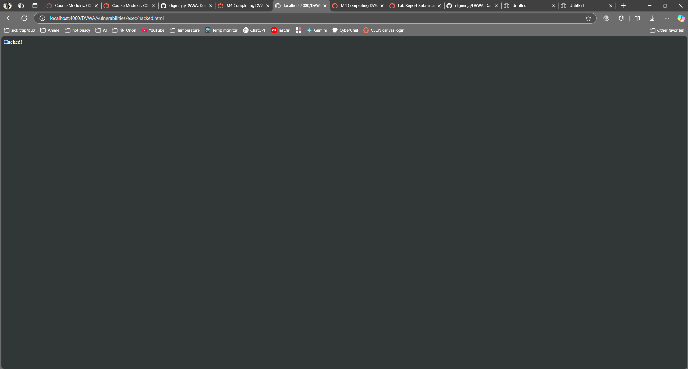
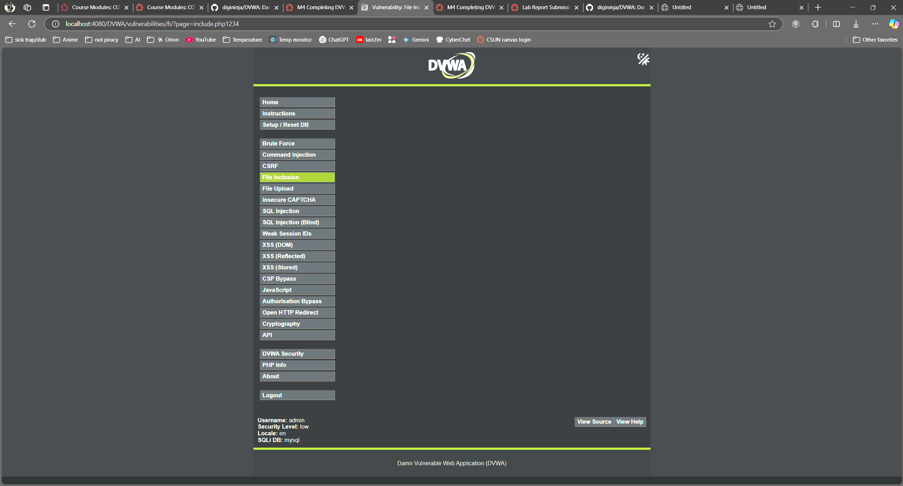
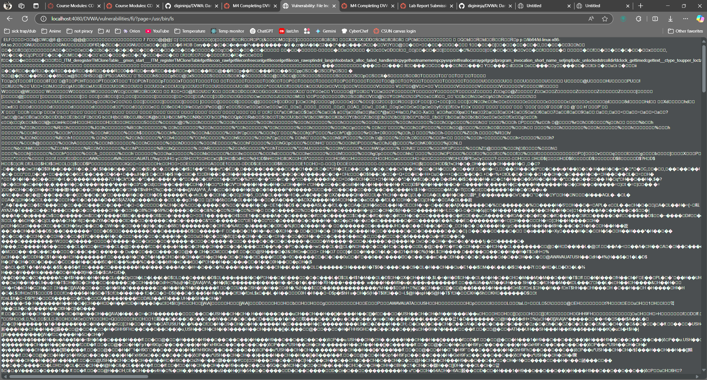
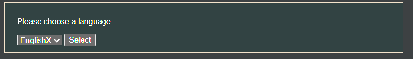
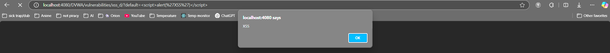
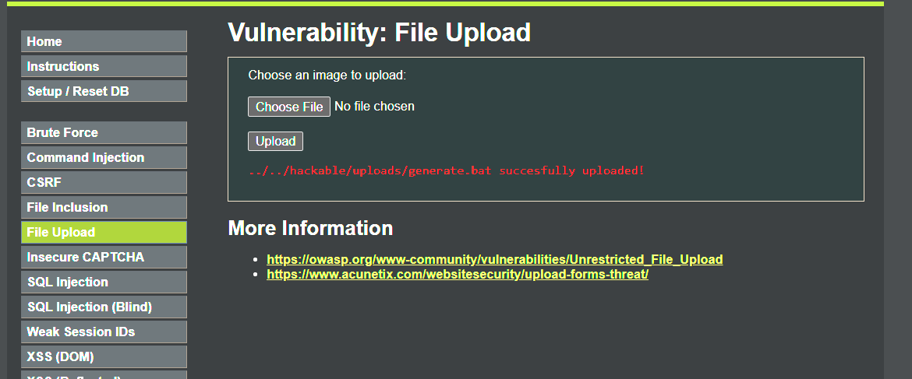

# M4 Completing DVWA Practice Sections

## 1. SQL Injection

In order to complete this step, I had to reduce DVWA's security level to 'Low' in the sidebar.

To start, I knew a little bit about SQL Injection, so I just tried the classic `' OR '1'='1` query, and it gave me a nice list of all the users:

```
ID: ' OR '1'='1
First name: admin
Surname: admin
ID: ' OR '1'='1
First name: Gordon
Surname: Brown
ID: ' OR '1'='1
First name: Hack
Surname: Me
ID: ' OR '1'='1
First name: Pablo
Surname: Picasso
ID: ' OR '1'='1
First name: Bob
Surname: Smith
```

Then, for fun, I tried `'; INSERT INTO users (user_id, first_name, last_name, user, password) VALUES (999, 'Harrison', 'wtfwtf', 'lol', 'letmein');-- -`, but it gave me a 500 error.

This vulnerability could easily be mitigated by escaping the input, or restricting the input to use alphanumeric characters only.

## 2. Command Injection

Just to test this one out, I put in a normal IP address (8.8.8.8), and this is what it output:

```
PING 8.8.8.8 (8.8.8.8) 56(84) bytes of data.
64 bytes from 8.8.8.8: icmp_seq=1 ttl=57 time=9.55 ms
64 bytes from 8.8.8.8: icmp_seq=2 ttl=57 time=9.90 ms
64 bytes from 8.8.8.8: icmp_seq=3 ttl=57 time=11.2 ms
64 bytes from 8.8.8.8: icmp_seq=4 ttl=57 time=9.55 ms

--- 8.8.8.8 ping statistics ---
4 packets transmitted, 4 received, 0% packet loss, time 3006ms
rtt min/avg/max/mdev = 9.548/10.057/11.235/0.694 ms
```

It's clearly using the `ping` CLI tool. Knowing this, I used `8.8.8.8 && whoami` and it gave me the user that the process was running under:

```
PING 8.8.8.8 (8.8.8.8) 56(84) bytes of data.
64 bytes from 8.8.8.8: icmp_seq=1 ttl=57 time=9.54 ms
64 bytes from 8.8.8.8: icmp_seq=2 ttl=57 time=10.4 ms
64 bytes from 8.8.8.8: icmp_seq=3 ttl=57 time=10.1 ms
64 bytes from 8.8.8.8: icmp_seq=4 ttl=57 time=9.27 ms

--- 8.8.8.8 ping statistics ---
4 packets transmitted, 4 received, 0% packet loss, time 3005ms
rtt min/avg/max/mdev = 9.274/9.828/10.372/0.441 ms
www-data
```

After that, I decided to do something malicious, and added ~~`8.8.8.8 && rm -rf *`~~ (jk) `8.8.8.8 && pwd` and it gave me the current directory:

```
...
/var/www/html/DVWA/vulnerabilities/exec
```

So I wrote a cool website to /var/www/html/hacked.html (also limited the number of packets to 1 so it doesn't take so long): `-c 1 8.8.8.8 && echo '<html><body><h1>Hacked!</h1></body></html>' > hacked.html` and booom.



That was fun. This arbitrary command execution vulnerability could easily be mitigated by input validation in the backend. You could even just ping a server in native PHP if you wanted to. Using exec in PHP with user input is usually not good. Or using PHP in general. lol

## File Inclusion

For this one I went in blind, so I went to the URL of the page and added some random characters to it: `http://localhost:4080/DVWA/vulnerabilities/fi/?page=include.php1234`



I'm assuming that it was trying to find a file called `include.php1234`, so I tried `http://localhost:4080/DVWA/vulnerabilities/fi/?page=/usr/bin/ls` and it output the file contents of `ls`!



Very cool. This vulnerability could be used to read any file on the server (if it's allowed by www-data). It could be mitigated by restricting the input to only allowed files.

## Cross-Site Scripting (XSS)

I also have a little bit of experience with XSS, so I also went in blind for this one and just added a character to the end of the URL, noticing that the input box on the screen had the same value as the `default` value in the URL: `http://localhost:4080/DVWA/vulnerabilities/xss_d/?default=EnglishX`



Cool, so it's reading from the URL parameter and writing it to the `<input>` element on the page. Then I tried `http://localhost:4080/DVWA/vulnerabilities/xss_d/?default=<script>alert('XSS')</script>` and it gave me a popup!



This vulnerability could be used to inject malicious code into the page. I'm not 100% sure if it can be used to steal cookies and post them to a server, but code injection is bad regardless. It could be mitigated by escaping the input from the URL parameter. I remember using this vulnerability in a past class, where my professor made a Twitter-like social media webapp and forgot to escape the input, so I was able to pop up an alert on everyone's browser.

### Reflected vs. Stored XSS

AFAIK, reflected XSS is just temporarily stored in the URL parameter, while stored XSS is stored in the database, and therefore persistent. What I used here was reflected XSS.

## Cross-Site Request Forgery (CSRF)

I've never used CSRF before, but I remember that it's when a user visits a website and the website makes a request to another website without the user's knowledge. While I was trying to change the admin password using this exersise, I noticed that when changed, the URL was set to:

```
http://localhost:4080/DVWA/vulnerabilities/csrf/?password_new=1234&password_conf=1234&Change=Change#
```

So whoever visits this page will have their password changed to `1234`. This is a serious vulnerability, just having another user click on this link will change their password and cause their account to be compromised.

You could mitigate this vulnerability using CSRF tokens. CSRF tokens are unique for each user, and are used to verify that the request is coming from the user's browser. CAPTCHA tokens are used to verify that the user is a human, and not a bot or hacker.

## Brute Force

The brute force exercise was pretty straightforward - there's no rate limit / attempt restriction on the login page. You can use something like hydra and a wordlist to try and guess the password. It might be a little tougher on this specific page since it doesn't return a 401 error when the password is wrong, but the idea is there.

This could be mitigated by adding rate limiting, or a CAPTCHA, or locking the account after a certain number of failed attempts.

## File Upload Vulnerability

This one should have been straightforward, but when I tried to upload an actual jpeg image to test it, it gave me a 'Your image was not uploaded.` error. It only works for some images.

This one was kinda weird, I tried to upload a random batch file I had on my workstation and it still uploaded it. It also appears not to check file size, so technically you could use this vulnerability as file storage. Or cause a DoS attack by uploading a really big file.



In order to make this more secure, I would add file size restrictions, and also check the file type, mime type as well.

## Security Level Changes and Observations

Switching the security modes in DVWA makes exploitation much harder. None of my previous tricks worked. It's cool how you can click 'View source' on each exercise and see how the code works for each level. For example, in 'Low' mode, the SQL injection vulnerability is super easy to exploit. Nothing is checked, it just runs the query.

```php
<?php

if( isset( $_REQUEST[ 'Submit' ] ) ) {
    // Get input
    $id = $_REQUEST[ 'id' ];

    switch ($_DVWA['SQLI_DB']) {
        case MYSQL:
            // Check database
            $query  = "SELECT first_name, last_name FROM users WHERE user_id = '$id';";
            $result = mysqli_query($GLOBALS["___mysqli_ston"],  $query ) or die( '<pre>' . ((is_object($GLOBALS["___mysqli_ston"])) ? mysqli_error($GLOBALS["___mysqli_ston"]) : (($___mysqli_res = mysqli_connect_error()) ? $___mysqli_res : false)) . '</pre>' );

            // Get results
            while( $row = mysqli_fetch_assoc( $result ) ) {
                // Get values
                $first = $row["first_name"];
                $last  = $row["last_name"];

                // Feedback for end user
                echo "<pre>ID: {$id}<br />First name: {$first}<br />Surname: {$last}</pre>";
            }

            mysqli_close($GLOBALS["___mysqli_ston"]);
            break;
        case SQLITE:
            global $sqlite_db_connection;

            #$sqlite_db_connection = new SQLite3($_DVWA['SQLITE_DB']);
            #$sqlite_db_connection->enableExceptions(true);

            $query  = "SELECT first_name, last_name FROM users WHERE user_id = '$id';";
            #print $query;
            try {
                $results = $sqlite_db_connection->query($query);
            } catch (Exception $e) {
                echo 'Caught exception: ' . $e->getMessage();
                exit();
            }

            if ($results) {
                while ($row = $results->fetchArray()) {
                    // Get values
                    $first = $row["first_name"];
                    $last  = $row["last_name"];

                    // Feedback for end user
                    echo "<pre>ID: {$id}<br />First name: {$first}<br />Surname: {$last}</pre>";
                }
            } else {
                echo "Error in fetch ".$sqlite_db->lastErrorMsg();
            }
            break;
    } 
}

?>
```

But in the 'Medium' mode, the input is escaped before it's used in the query, so the SQL injection vulnerability is much harder to exploit.

---

I had a lot of fun with DVWA. This has been my favorite lab so far.