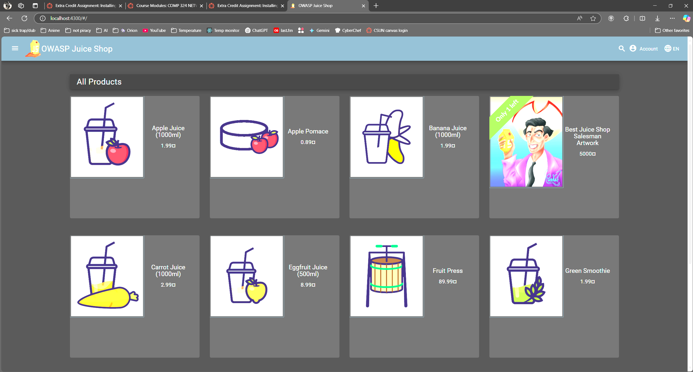

# Extra Credit Assignment: Installing and Exploring OWASP Juice Shop



I installed OWASP Juice Shop on my system from source and had 0 issues. All I did was clone the repo:

```
git clone https://github.com/juice-shop/juice-shop.git --depth 1 && cd juice-shop
```

Then I installed the dependencies and ran the app:

```
npm install
npm start
```

## Reflection questions

I've used node webapps before, so this was really similar. Vulnerable apps like this one and DVWA are super useful for learning about web security and testing exploits. It's a cool sandbox environment.